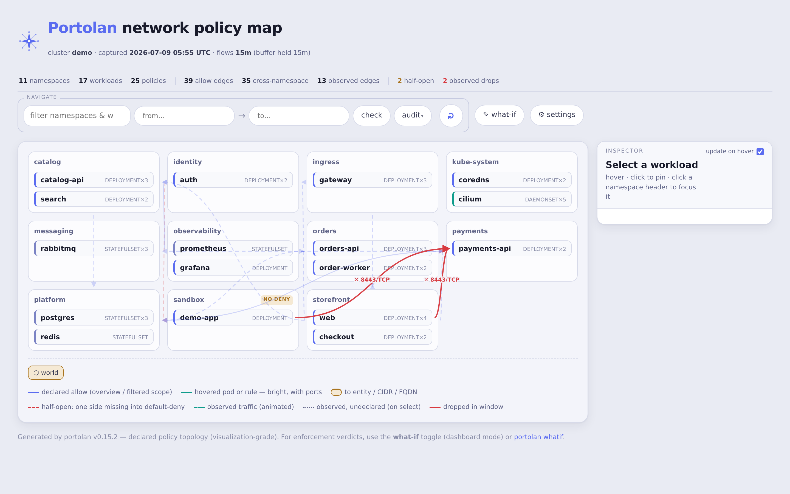
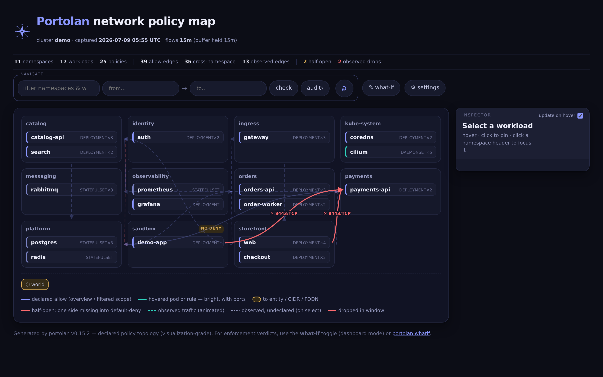
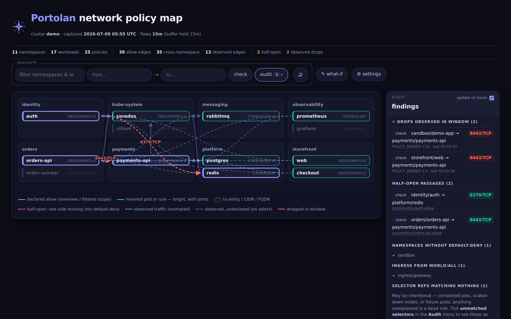
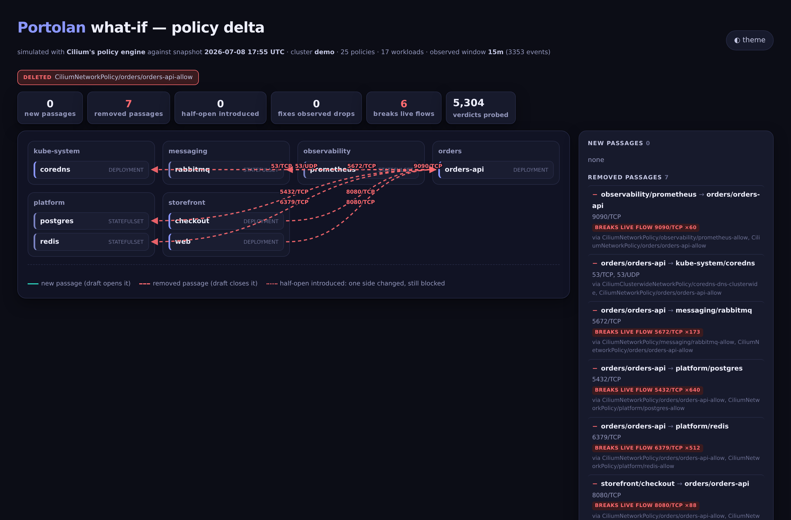

<p align="center">
  
</p>

<h1 align="center">Portolan</h1>

<p align="center">
  <strong>A chart of every permitted passage in your Cilium cluster.</strong><br>
  See the allow-topology, catch half-open policy gaps, and simulate a change's
  blast radius — with verdicts from Cilium's own engine — before it ships.
</p>

<p align="center">
  <a href="LICENSE"></a>
  
  
</p>

<table>
<tr>
<td width="50%"></td>
<td width="50%"></td>
</tr>
</table>

<p align="center"><sub>The same demo cluster, <b>light and dark</b> — Portolan is theme-aware. Every screenshot here is of the bundled <a href="docs/demo-snapshot.json">demo snapshot</a>, a fabricated cluster: try it with <code>portolan render -i docs/demo-snapshot.json</code> — no cluster needed.</sub></p>

In a cluster with hundreds of CiliumNetworkPolicies across dozens of namespaces,
nobody holds the allow-topology in their head. Hubble shows you the traffic that
*happened*; Portolan shows you the traffic that is *permitted* — and the gaps
where the two disagree.

## Highlights

- 🗺️ **The whole chart, one file.** Every declared allow-edge — namespaces,
  workloads, ports, direction — rendered as a self-contained HTML map. No
  database, no backend required to view it.
- 🔎 **Catches half-open passages.** Traffic allowed *out* of one namespace but
  never *into* the default-deny namespace it targets — a one-sided-rule
  misconfiguration that's invisible in raw YAML. Portolan flags every one.
- 🧪 **Verdict-grade what-if.** Draft a policy change and see exactly what it
  opens, what it closes, which half-opens it heals or introduces, and which
  **live flows it would break** — computed by *Cilium's own policy engine*
  linked in-process, not a reimplementation. Millions of pair/port verdicts in
  seconds.
- 👁️ **Declared vs. observed, joined.** Overlay a bounded Hubble window: declared
  edges that carried real traffic animate; undeclared traffic draws as ghosts;
  denials draw red. Observed and declared join on the same workload identities.
- 🔒 **Read-only by design.** `get`/`list`/`watch` only — it never writes to your
  cluster. Authoring output is YAML for *you* to review and commit.

## Why "Portolan"?

A *portolan* is a medieval nautical chart. Unlike maps that drew coastlines for
their own sake, portolan charts existed for one purpose: showing sailors the
**permitted passages between ports** — the routes you could actually take.

That is exactly what this tool draws for your cluster: every route traffic is
allowed to take, port numbers and all. Anything off the charted paths gets
dropped. In a cluster with hundreds of CiliumNetworkPolicies spread across
dozens of namespaces, nobody holds that chart in their head — Portolan draws it.

## What it does

- **Snapshot** — captures every declared policy (CiliumNetworkPolicy,
  CiliumClusterwideNetworkPolicy, and native NetworkPolicy), plus the
  namespaces and workloads they select, into one deterministic JSON artifact.
  Working today.
- **Map** — renders a snapshot as a directional, port-labeled graph in one
  self-contained HTML file: namespace boundaries, default-deny coverage,
  cross-namespace allows, and **half-open passages** (traffic allowed out of
  one namespace but not into the default-deny namespace it targets — a
  misconfiguration class that is invisible in raw YAML). Hubble shows you the
  traffic that *happened*; Portolan shows you the traffic that is *permitted*.
- **Passage query** — ask the map "can A reach B?" and get a verdict card:
  declared (with ports and the policies on each side), half-open (with the
  fix location named), or no passage (with what A may reach and what B
  accepts, so the missing rule's home is obvious).
- **Audit** — `portolan audit` (and the map's findings lens) reports half-open
  passages, namespaces without default-deny, workloads with declared ingress
  from the world, and selector references that match nothing.
  `--fail-on-findings` makes it a CI gate. Add `--brief findings.md` to emit
  a Markdown **investigation brief** — findings restructured as instructions
  for an LLM agent (or a human) with read access: evidence, ready-to-run
  verification commands, benign explanations to rule out, and orders to
  verify live state before concluding anything.

<p align="center">
  
</p>

- **Diff** — `portolan diff old.json new.json` compares two snapshots:
  policies added/removed/changed and the derived allow-edges that appeared or
  vanished. `--exit-code` for pipelines.
- **Observe** — `--flows 15m` reads a bounded look-back window from Hubble
  Relay and records what the datapath actually did, aggregated to workload
  granularity: observed edges, verdicts, and drop reasons (`POLICY_DENIED`
  drops are misconfiguration leads). Flow peers resolve to the same
  controller identities the policy map draws, so observed and declared edges
  join cleanly. Honesty metadata included: if Hubble's ring buffer covered
  less than the requested window, `flows.oldestFlow` says so.

  On the map, observation becomes texture: declared edges that carried real
  traffic **animate**; traffic with no per-pair declared edge (riding a
  broad allowance or an unpolicied namespace) draws as a dotted **ghost**;
  denials draw **red** and always show. The Display menu's findings lenses
  act as filters — enable `half-open` or `dropped` and the map contracts to
  those findings in the context of everything the involved workloads may
  reach. An `unmatched selectors` lens renders selector references matching
  no live workload as phantom nodes docked where the missing workload would
  sit — dormant rules you can see, hover, and trace to their declaring policy.
- **What-if** — `portolan whatif -i snapshot.json -f draft.yaml` computes the
  blast radius of a draft change (add, replace, or `--delete`) before it
  ships: passages it opens (flagging which heal existing half-opens),
  passages it removes, and **half-opens it would introduce** — the
  one-sided-rule mistake caught at review time instead of in production.
  With flow data in the snapshot it also reports which observed drops the
  draft fixes and which observed live flows it would **break**
  (`--fail-on-break` gates CI on that). Verdicts come from Cilium's own
  policy engine linked in-process — the same distillation pipeline the
  agent uses to program the datapath, fed identities built exactly the way
  the agent labels endpoints — not a reimplementation. Millions of
  pair/port verdicts compute in seconds. Add `-o whatif.html` for the
  **delta map**: the diff rendered visually — green passages the draft
  opens, red ones it closes, half-open and broken-live-flow badges — in
  the map's visual language, as a single self-contained file.

<p align="center">
  
</p>

> The delta map above is the whole point. Deleting one ordinary-looking
> policy would close **7 passages** and **break 6 live flows** — surfaced by
> simulating against Cilium's engine (5,304 verdicts) before anything ships.
> That's the blast radius you want at review time, not in an incident.

- **What-if panel (dashboard)** — in serve mode the map gains an
  interactive what-if: draft simplified allow rules (from, to, ports,
  sides) against live autocomplete, and the server simulates them with
  the Cilium engine on the latest snapshot. Projected passages march
  green over the current view, one-sided rules flag the half-open they'd
  introduce, and per-rule **generate** hands you the exact
  CiliumNetworkPolicy YAML that was simulated — one builder feeds both,
  so the preview cannot drift from the output. Projections persist as an
  overlay while you explore.

## What it deliberately does not do

- **It never writes to your cluster.** Portolan is read-only by design
  (`get`/`list`/`watch` on policies, namespaces, and pods — nothing else).
  Authoring output is YAML for *you* to review and commit; your GitOps pipeline
  stays the single path to change.
- **It is not a flow-forensics platform.** Observation uses short capture
  windows, not streaming retention.
- **It is not a single-policy editor.** For that,
  [editor.networkpolicy.io](https://editor.networkpolicy.io) already exists.

## Architecture

Everything is a producer or consumer of one artifact — the snapshot:

```
portolan snapshot ──► snapshot.json ──► portolan render   (static HTML map)
 (CLI or in-cluster        │
  serve mode)              ├──────────► portolan whatif   (blast radius of a draft policy)
                           │
                           └──────────► portolan serve    (dashboard: collects on an
                                                           interval, serves the map)
```

`snapshot.json` is the stable contract: namespaces, workloads, raw policy
rules, and per-source collection status (so a degraded capture is
distinguishable from a healthy zero-policy cluster). History is just a
directory of timestamped snapshots; diffing two of them answers "what changed
in the mesh since Tuesday." No database — snapshots are immutable files.

## Quick start

```sh
# No cluster handy? Render the bundled demo snapshot and open the map:
portolan render -i docs/demo-snapshot.json -o map.html

# Point at any cluster you can read (uses your kubeconfig, kubectl-style):
portolan snapshot -o snapshot.json

# Also capture what the datapath actually did (drops included) — needs
# Hubble Relay; from outside the cluster, port-forward it first:
#   kubectl -n kube-system port-forward svc/hubble-relay 4245:80
portolan snapshot --flows 15m --hubble-server localhost:4245 -o snapshot.json

# Keeping history? Timestamp the filenames — diffs between any two answer
# "what changed":
portolan snapshot -o "snapshots/$(date +%Y%m%dT%H%M%S).json"

# Render the map — a single HTML file, open it anywhere:
portolan render -i snapshot.json -o map.html

# Findings report (half-open passages, deny gaps, dead selector refs):
portolan audit -i snapshot.json

# What changed in the mesh between two captures?
portolan diff snapshots/monday.json snapshots/today.json

# Simulate a draft policy before it ships (text verdicts + visual delta map):
portolan whatif -i snapshot.json -f draft-cnp.yaml -o whatif.html
portolan whatif -i snapshot.json --delete CiliumNetworkPolicy/ns/name --fail-on-break

# Or run the dashboard in-cluster (or anywhere with a kubeconfig):
portolan serve --interval 15m --data /data
#   GET /              the map        GET /audit.json     findings
#   GET /brief.md      LLM handoff    GET /snapshots/     history archive
#   GET /healthz       liveness       GET /snapshot.json  latest capture
#   POST /api/whatif   simulate simplified allow rules (the map's panel)
```

A Helm chart for the in-cluster dashboard lives in [`charts/portolan`](charts/portolan).

## Authentication

The dashboard renders, in effect, a cluster attack map — it should not be served
open on an untrusted network. `serve` supports opt-in sign-in; it defaults to
`none` (open) so nothing changes for trusted-network or proxy-gated setups.

**Local login** requires a username and password before any route except
`/healthz` and the login page. Sessions are a stateless, signed-and-encrypted
cookie (AES-256-GCM) — no server-side session store, no database. Set it up in
three steps:

```bash
# 1. A 32-byte key that signs the session cookie:
head -c32 /dev/urandom | base64

# 2. One line per user (bcrypt-hashed; the password is read from stdin):
portolan hashpw alice           # -> alice:$2a$10$...

# 3. Run with both. The key/users can also come from
#    PORTOLAN_AUTH_SESSION_KEY and PORTOLAN_AUTH_USERS_FILE:
portolan serve --auth-mode local \
  --auth-session-key "$KEY" --auth-users-file ./users
```

On the Helm chart, create a Secret holding `session-key` and `users`, then point
the release at it — credentials never live in values or the chart:

```bash
kubectl create secret generic portolan-auth \
  --from-literal=session-key="$(head -c32 /dev/urandom | base64)" \
  --from-file=users=./users
helm upgrade --install portolan charts/portolan \
  --set auth.mode=local --set auth.existingSecret=portolan-auth
```

Misconfiguration **fails closed**: local mode without a key or users file exits
before the server binds, so a half-configured deploy never serves open. Because
sessions are stateless there is no server-side revocation — sign-out clears the
cookie, and rotating the session key invalidates every issued session at once.

> Native **OIDC** (self-contained login against Keycloak/Authentik and other
> providers) and **forward-auth** header trust are on the [roadmap](#access);
> the session layer above is shared with both.

## Status

Early but working: `snapshot`, `render`, `audit`, `diff`, `serve`, and
`whatif` function today. The snapshot schema is versioned; breaking changes
bump the version.

## Roadmap

Where Portolan is headed — shaped by two commitments that won't change: it stays
**read-only**, and every verdict comes from **Cilium's own engine**, never a
reimplementation or a guess.

### Trustworthy observation

- **Continuous flow accumulation** *(planned)* — today's flow overlay is a single
  point-in-time read of Hubble's ring buffer, which often holds far less than the
  window you asked for. Serve mode will instead *stream* and accumulate observed
  edges into a rolling store, so "observed" reflects a real 24h/7d window —
  periodic and rare traffic included. Robust half-open and drop detection depends
  on this.

### Access

- **Local login** *(available)* — username/password sign-in with stateless
  signed-cookie sessions, no database. See [Authentication](#authentication).
- **Native OIDC** *(planned)* — self-contained login against Keycloak, Authentik,
  and other providers for standalone deployments, no proxy required. Reuses the
  session layer that local login already ships.
- **Forward-auth support** *(exploring)* — first-class support for running behind
  an existing OIDC proxy (oauth2-proxy, Authentik) by trusting an auth header.

### From map to assistant — agent-ready, not "AI inside"

Portolan will **not** embed an LLM or call one on your behalf. Instead it produces
the perfect *input* for whatever model you already use, and is the deterministic
*oracle* that model's output is checked against. Your agent stays yours; Portolan
stays a read-only instrument.

- **LLM-ready cluster brief** *(planned)* — enrich `portolan audit --brief` into a
  complete network report: topology, observed flows, findings, ready-to-run
  verification commands, and a "what to fix" scaffold. Paste it into any LLM for
  policy advice — greenfield lockdown, or hardening existing rules.
- **Agent tooling (MCP server)** *(exploring)* — expose `snapshot`, `audit`,
  `brief`, and **`whatif` verification** as tools an agent (Claude, Codex, …) can
  drive in your own harness. The loop that makes it trustworthy — *the model drafts
  a policy; Cilium's engine proves it closes findings without breaking live
  traffic* — is the part no LLM can do alone. Output is always YAML for your GitOps
  pipeline; nothing is ever applied.

### Reach

- **Beyond Cilium** *(exploring)* — the snapshot schema is already CNI-agnostic
  (open-ended policy kinds + a pluggable evaluator). Native `NetworkPolicy` (and
  Calico) support would open Portolan to any Kubernetes cluster.
- **CI/CD integration** *(planned)* — `audit --fail-on-findings` and
  `whatif --fail-on-break` already gate pipelines; package them as a GitHub Action
  and a GitLab template so policy-drift and blast-radius checks drop in.

Smaller near-term polish: clearer wording for the *unmatched selectors* audit lens,
and an interactive capture-window control in Settings.

Have a use case that isn't here? Open an issue — the schema and the evaluator
interface are designed to be extended, not rewritten.

## License

[AGPL-3.0-or-later](LICENSE). Deploying and using Portolan carries no
obligations; if you modify it and offer it to others as a network service, you
must offer them your modified source too.
